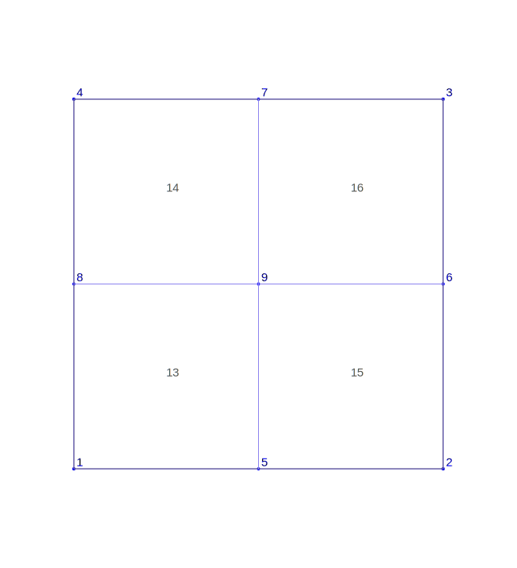

## FEDOF

:::note
Read the part 1 of this series [here](./understanding-fedof-1.md) before proceeding further.
:::

In this note we will study the FEDOF for scalar field using H1 conforming Hierarchical basis functions.
The main focus on the degree of freedom associated with vertex, face, and cell of the element.

## Mesh related stuff

In this note we will focus on 2D mesh with quadrilateral.



## Scalar FEDOF

Initiate the FEDOF object and scalar field by using the following code.

```fortran
CALL u%ImportFromToml(tomlName="u", fedof=fedof, dom=dom, filename=tomlFileName)
CALL fedof%Display(msg="FEDOF info: ")
```

## Getting all the connectivity


The following code gets all the DOF in an element.

```txt
1   5   9   8  10  11  12  13  14  15  16  17  18  19  20  21  46  47  48  49  50  51  52  53  54
```

## Vertex connectivity

Following code gets the vertex DOF connectivity.

```fortran
nrow = fedof%GetTotalDOF(globalElement=1, islocal=yes, opt="V")
CALL Display(nrow, "Total Vertex DOF for localElement=1:")

con = fedof%GetConnectivity(globalElement=1, islocal=yes, opt="V")
CALL Display(con, "Vertex DOF connectivity for localElement=1:")
```

```txt
1 5 9 8
```

:::note
These are local DOF numbers, and it has nothing to do with the mesh connectivity.
:::

We can get the DOF of a single vertex by using `GetVertexDOF()` as shown below.

```fortran
CALL Reallocate(con, 100)
call cellMesh%GetConnectivity_(globalElement=1, islocal=yes, opt="V", ans=con, tsize=tsize)
CALL fedof%GetVertexDOF(globalNode=con(1), islocal=.false., ans=con, tsize=tsize)
CALL Display(con(1), "DOF of vertex 1 of element 1:")
```

## Face connectivity

Following code gets the connectivity of all face DOF in an element. Note that these face DOF are local. In addition, they are related to the positive oriented faces only.

```fortran
nrow = fedof%GetTotalDOF(globalElement=1, islocal=yes, opt="F")
CALL Display(nrow, "Total Face DOF for localElement=1:")

con = fedof%GetConnectivity(globalElement=1, islocal=yes, opt="F")
CALL Display(con, "Face DOF connectivity for localElement=1:", full=.TRUE., &
             orient="R")
```

```txt
10  11  12  13  14  15  16  17  18  19  20  21
```

We can get the DOF of a face by using `GetFaceDOF()` as shown below.

```fortran
CALL Reallocate(con, 100, isExpand=.TRUE., expandFactor=2)
CALL cellMesh%GetConnectivity_(globalElement=1, islocal=yes, opt="F", &
                               ans=con, tsize=tsize)
nrow = con(1)
CALL fedof%GetFaceDOF(globalFace=nrow, islocal=.TRUE., ans=con, &
                      tsize=tsize)
CALL Display(con(1:tsize), "DOF on face: "//ToString(nrow), full=.TRUE., &
             orient="R")
```

:::info DOF on face: 1

```txt
10  11  12
```

:::

Getting dof on local face 3 on element 1:

```fortran
CALL Reallocate(con, 100, isExpand=.TRUE., expandFactor=2)
CALL cellMesh%GetConnectivity_(globalElement=1, islocal=yes, opt="F", &
                               ans=con, tsize=tsize)
nrow = con(3)
CALL fedof%GetFaceDOF(globalFace=nrow, islocal=.TRUE., ans=con, &
                      tsize=tsize)
CALL Display(con(1:tsize), "DOF on face: "//ToString(nrow), full=.TRUE., &
             orient="R")
```

:::info DOF of face: 3

```txt
16 17 18
```

:::

## Cell connectivity

Following code gets the connectivity of cell in an element. Note that these DOFs are local.

```fortran
nrow = fedof%GetTotalDOF(globalElement=1, islocal=yes, opt="C")
CALL Display(nrow, "Total Cell DOF for localElement=1:")

con = fedof%GetConnectivity(globalElement=1, islocal=yes, opt="C")
CALL Display(con, "Cell DOF connectivity for localElement=1:")
```

:::info Result

```txt
46  47  48  49  50  51  52  53  54
```

:::

We can get the cell DOF by using `GetCellDOF()` as shown below.

```fortran
CALL Reallocate(con, 100, isExpand=.TRUE., expandFactor=2)
CALL cellMesh%GetConnectivity_(globalElement=1, islocal=yes, opt="C", &
                               ans=con, tsize=tsize)
nrow = con(1)
CALL fedof%GetCellDOF(globalCell=nrow, islocal=.FALSE., ans=con, &
                      tsize=tsize)
CALL Display(con(1:tsize), "DOF in cell: "//ToString(nrow), full=.TRUE., &
             orient="R")
```

:::info DOF in cell: 13

```txt
46  47  48  49  50  51  52  53  54
```

:::
