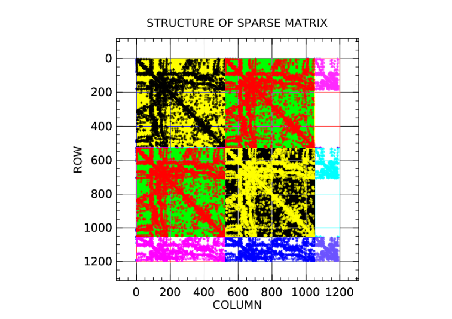

This example show how to initiate an instance of `Domain_`, `DOF_`, `CSRMatrix_`
and set the sparsity pattern in the sparse matrix.
The velocity domain is given below.

```fortran
PROGRAM main
USE easifemBase
USE easifemClasses
IMPLICIT NONE
TYPE( Domain_ ), TARGET :: pressureDomain
TYPE( Domain_ ), TARGET :: velocityDomain
TYPE( DomainPointer_ ) :: domains( 2 )
TYPE( HDF5File_ ) :: pressureMeshFile
TYPE( HDF5File_ ) :: velocityMeshFile
TYPE( CSRMatrix_ ) :: mat
TYPE( DOF_ ) :: dofobj
CHARACTER(*), PARAMETER :: filename_velocity= &
  & "../../Mesh/examples/meshdata/small_tri6_mesh.h5" 
CHARACTER(*), PARAMETER :: filename_pressure= &
  & "../../Mesh/examples/meshdata/small_tri3_mesh.h5" 

! Open meshfile for velocity and pressure variable.
CALL velocityMeshFile%Initiate( fileName=filename_velocity, mode="READ" )
CALL velocityMeshFile%Open()
CALL pressureMeshFile%Initiate( fileName=filename_pressure, mode="READ" )
CALL pressureMeshFile%Open()

! Initiates domain for pressure and velocity variable.
CALL velocityDomain%Initiate( velocityMeshFile, "")
CALL pressureDomain%Initiate( pressureMeshFile, "")
domains(1)%ptr => velocityDomain
domains(2)%ptr => pressureDomain

! Now that the domain is ready, we can create a degree of freedom object DOF.

CALL Initiate( obj=dofobj, &
  & tNodes=[.tNodes. velocityDomain, .tNodes. pressureDomain], &
  & names=['V', 'P'], &
  & spaceCompo=[2, 1], &
  & timeCompo=[1,1], &
  & storageFMT=FMT_DOF)

! Initiate an instance of [CSRMatrix](../CSRMatrix/CSRMatrix_.md), mat.

CALL Initiate( mat, ncol=.tnodes. dofobj, nrow=.tnodes. dofobj, &
  & dof=dofobj )

! Now we will pass mat to domain and set the sparsity pattern.

CALL velocityDomain%SetSparsity( domains=domains, mat=mat )
CALL SPY( mat, "test_5", ".png")

CALL Deallocate( mat )
NULLIFY(domains(1)%ptr, domains(2)%ptr)
CALL pressureDomain%Deallocate()
CALL velocityDomain%Deallocate()
CALL velocityMeshFile%Deallocate()
CALL pressureMeshFile%Deallocate()
END PROGRAM main
```

The result of this program is given below.


