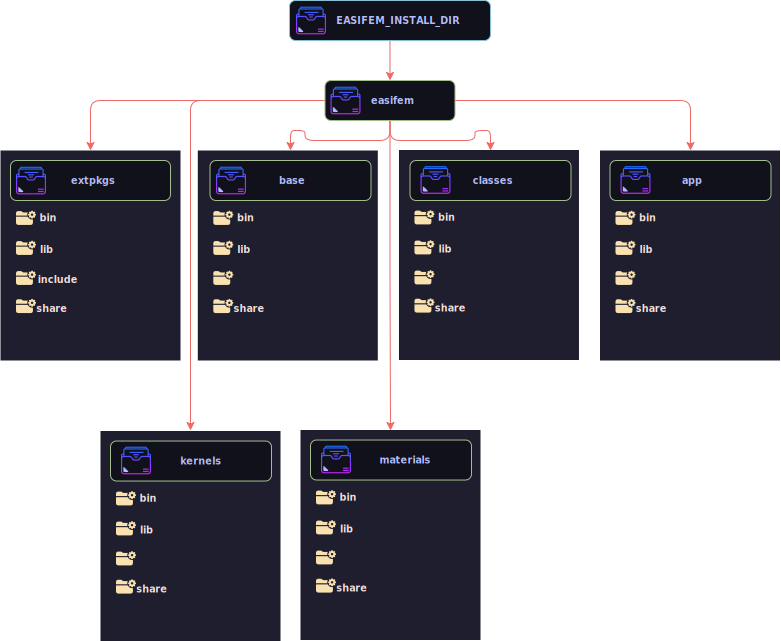

In this section you will learn how to configure, build, and install EASIFEM as per your need. Before we start let us talk about the dependencies of EASIFEM. We can categorize the dependencies of EASIFEM into the following.

1. System level dependencies
2. External packages dependencies

The system level dependencies are related to building and installing some of the libraries. Usually, we will install them from the package managers such as `apt`, `yay`, `pacman`, `brew`, etc. [You can found more about the system dependencies here.](/about/SystemRequirements)

The external package dependencies includes open sourced Fortran and C libraries, which are used in the source code of easifem. These external packages are not shipped with the source code of easifem. Also, we will build and install them from the source. [You can found more about the external packages here.](/about/extpkgs)

After installation of these dependencies, we will head on to installing the EASIFEM components such as:

1. `easifemBase`
2. `easifemClasses`
3. `easifemMaterials`
4. `easifemKernels`

After a successful installation of EASIFEM, the EASIFEM file system takes the form as shown in Figure 1.

In this figure `EASIFEM_INSTALL_DIR` is the location of the file system where EASIFEM is installed. For example, if you want to install easifem at `~/local`, then `EASIFEM_INSTALL_DIR=~/local`.

:::note Summary
Installation steps of EASIFEM involves following steps.

- Step 1: Download the command line application for managing EASIFEM packages.
- Step 2: Set up the EASIFEM environment variables.
- Step 3: Install the system dependencies.
- Step 4: Install external packages.
- Step 5: Install EASIFEM components such as `easifemBase`, `easifemClasses`, `easifemMaterials`, and `easifemKernels`.
:::

import ClientSetup from '/docs/partials/_install-index.mdx';

<ClientSetup></ClientSetup>
